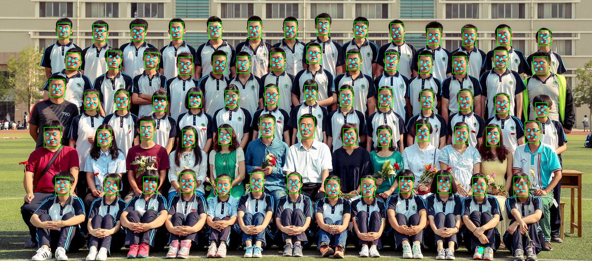

# Fast-MTCNN

A casual work about retainining mtcnn Pnet and Onet. make it a little bit fast,which achiciving 100fps+ (1920*1080 minSize 60) at intel i7 6700k (st),but the accuracy is not so well.

## Dependencies

+ OpenCV 3.4.1 only

The demo base on [OpenCV](https://github.com/opencv/opencv) DNN module. my computer with Intel i7 6700k (st) can achicive 100fps+ (1920*1080 minSize 60)compiled with OpenBLAS (OpenCV 3.4.1) ,if you wanna achieve the better performance.you can compile with [Intel MKL-DNN Inference Engine package](https://github.com/opencv/opencv/wiki/Intel%27s-Deep-Learning-Inference-Engine-backend) to accelerate.

### Demo Image

## Anthor

+ Jack Yu

  ​
